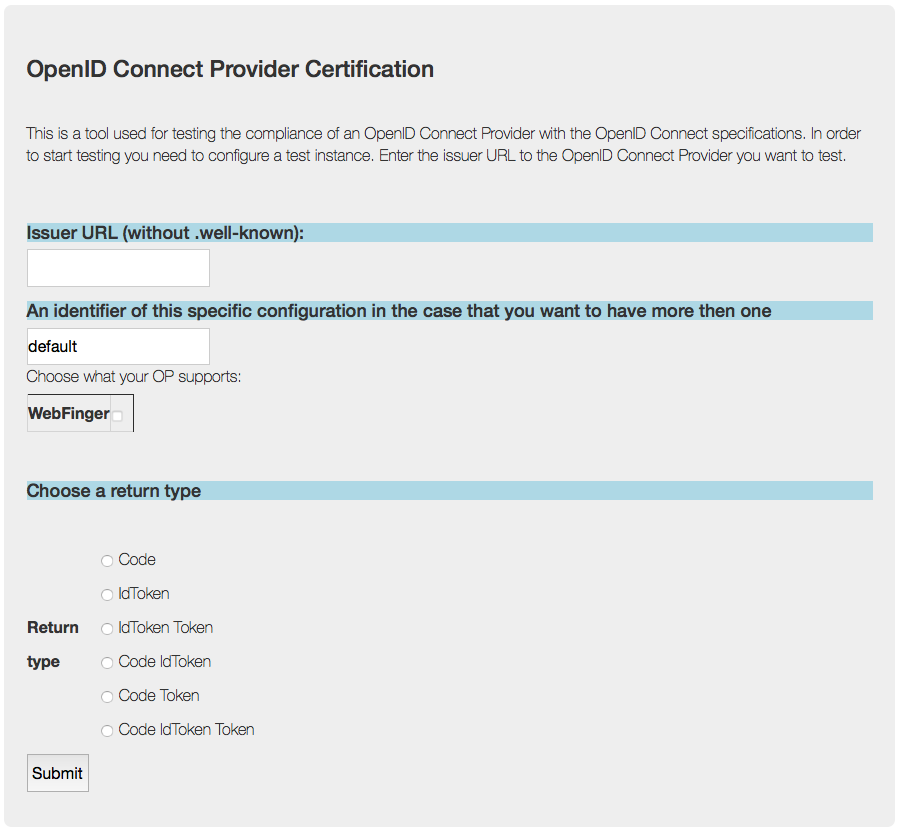

.. _web interface:

=========================================================================
Running the OP test tool using the form based interface for configuration
=========================================================================

------------------------
The configuration server
------------------------

The configuration server is again a Python script::

    $ config_server.py -h
    usage: config_server.py [-h] [-b BASE_URL] [-c TEST_TOOL_CONF] [-f FLOWS]
                            [-m PATH2PORT] [-p PORT] [-t] [-M MAKO_DIR]
                            config

    positional arguments:
      config

    optional arguments:
      -h, --help         show this help message and exit
      -b BASE_URL
      -c TEST_TOOL_CONF
      -f FLOWS
      -m PATH2PORT
      -p PORT
      -t
      -M MAKO_DIR

-b
**

You should really set this in the configuration file rather then using
this option. Anyway this is the base from which the tool will construct the
necessary URLs.

-c
**

More about the test tool configuration :ref:`here <tt_config>`

-f
**

The :ref:`flows <tt_opt_flow>` information is passed on to the test tool instance

-m
**

The :ref:`path2port <path2port>` information is passed on to the test tool instance

-p
**

Which port the configuration server should listen on

-t
**

Turns on HTTPS support. If set the configuration server will not listen to HTTP
calls

-M
**

The :ref:`Mako dir <tt_opt_mako>` information is passed on to the test tool instance

config
******

The configuration file looks like this::

    import os

    BASEDIR = os.path.abspath(os.path.dirname(__file__))

    SERVER_CERT = "./certs/cert.pem"
    SERVER_KEY = "./certs/key.pem"
    CERT_CHAIN = None

    #VERIFY_SSL = False

    BASE_URL = 'http://localhost'
    MAKO_DIR = './heart_mako'
    ENT_PATH = './entities'
    ENT_INFO = './entity_info'

    FLOWS = ['./flows.yaml']

    PATH2PORT = './path2port.csv'
    PORT_MIN = 9100
    PORT_MAX = 9149

SERVER_CERT, SERVER_KEY and CERT_CHAIN
++++++++++++++++++++++++++++++++++++++

Are only necessary if the test instance is supposed to do HTTPS.

BASE
++++

*passed on to a test tool instace*
The base from which the urls, that the test instance (as an RP) publishes, are
constructed. This includes claims like *redirect_uris*, *jwks_uri*, *tos_url*,
*logo_uri*, *client_uri*, *policy_uri*, *sector_identifier_uri* and possibly
more.

ENT_PATH
++++++++

*passed on to a test tool instance*
A path to where the test configurations are stored. The confirations are
stored in a tree of the form <issuer identifier>/<tag> like this::

    https%3A%2F%2Fexample.com --+-- code
                                |
                                +-- idtoken

As you can see the *issuer identifier* is quoted to be URL safe.
The same goes for the tag though that isn't obvious from the example above.

ENT_INFO
++++++++

*passed on to a test tool instance*
This is information about the test instance which is static and
should not differ between different test instances. Some of the information
here represents default values and may be changed.

FLOWS
+++++

*passed on to a test tool instance*
YAML files that contains descriptions of all the test in a domain specific
manner. If you want to understand more about the test descriptions you can
read more about them in :ref:`Test description language`.

PATH2PORT
+++++++++

*passed on to a test tool instance*
More about this :ref:`here <path2port>`.

PORT_MAX, PORT_MIN
++++++++++++++++++

Defines the number of test instances that the configuration server can
spin off and which ports that must be used. When all ports are taken
no more test instance can be started unless a running test instance is
removed.

-----------------
The web interface
-----------------

When you have started a configuration server you can connect to the
port it listens on and wsee this:

